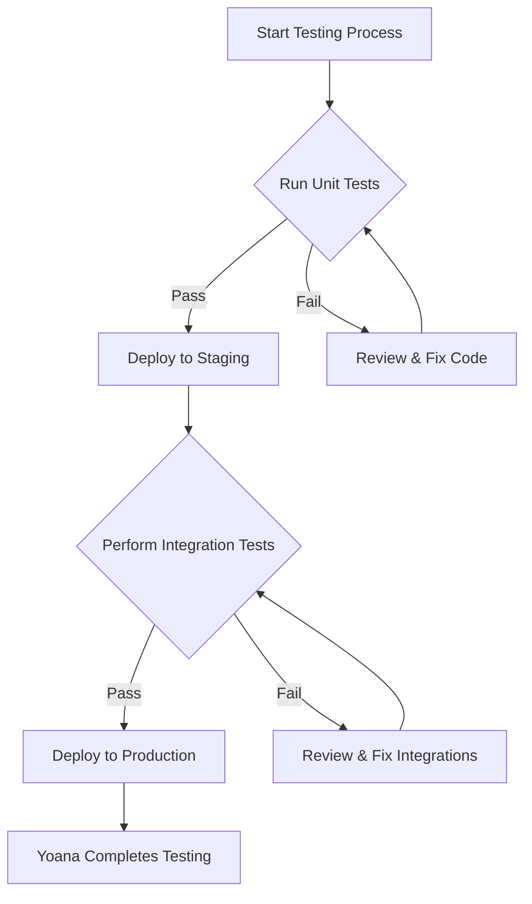

# yoana-is-testing
test repo for datahub cloud

# Yoana's Imaginary Exploration of Datahub Cloud

## Discovering the Interface

Yoana embarked on her journey into Datahub Cloud, intrigued by its promises of streamlined data management. *The interface*, she noted, was **intuitive**, facilitating a seamless ***integration*** process with her existing data sources.

### Delving into Data Ingestion

With keen interest, Yoana navigated through the data ingestion process. `Data connectors` were abundant, allowing her to effortlessly link her diverse datasets. The ease of bringing her data into the cloud environment was impressive.

#### Analyzing Data Structures

As Yoana delved deeper, the organizational capabilities of Datahub Cloud became evident. She appreciated how it enabled a clear view of her data's schema, relationships, and lineage, enhancing her understanding and control over her data landscape.

##### Customizing Data Views

The customization options caught Yoana's eye. She could tailor her data views to align with her project's needs, ensuring efficient access to the most relevant data insights. This flexibility was crucial for her dynamic analysis requirements.

###### Secure Collaboration

What truly stood out for Yoana was Datahub Cloud's emphasis on security and collaboration. She could share insights with her team while maintaining strict control over data access, fostering a collaborative yet secure environment.

---

### Key Features Highlighted by Yoana

- User-friendly interface for seamless navigation
- Extensive data connectors for easy data integration
  - Real-time data syncing
  - Support for various data formats

1. Comprehensive data management tools
2. Advanced analytics and visualization capabilities
   1. Custom dashboards
   2. Interactive reports

### Useful Links

[Datahub Cloud Documentation](https://www.datahub.io/docs)

### Inspiring Visuals


### Yoana's Reflections

> "Datahub Cloud has transformed the way I interact with my data. The platform's power, combined with its user-friendly nature, has made data management a truly enjoyable and productive part of my workflow."

### Data Queries and Scripts

Yoana often utilizes inline `SQL queries` to fetch specific data insights.

```sql
SELECT user_id, COUNT(*) as action_count
FROM user_actions
WHERE action_date >= '2023-01-01'
GROUP BY user_id
ORDER BY action_count DESC;

```
### Project Management Table

| Task                  | Status       | Deadline   |
|-----------------------|:------------:|-----------:|
| Data Integration      | Completed    | 2024-02-10 |
| Analytics Setup       | In Progress  | 2024-03-05 |
| Collaboration Setup   | Planned      | 2024-03-20 |

### Highlighting Key Takeaways

- **Intuitive Interface**: Simplifies navigation and data management, making it accessible for all user levels.
- **Comprehensive Data Integration**: Seamless integration with a variety of data sources enhances the platform's utility.
- **Customization and Flexibility**: Users can tailor the platform to meet their specific needs, improving the overall experience.


### To-Do List for Upcoming Features

- [ ] Develop more intuitive data connectors for emerging data sources.
- [ ] Enhance real-time data processing capabilities for instant insights.
- [ ] Introduce advanced machine learning models for predictive analytics.
- [ ] Expand customization options for reports and dashboards.
- [ ] Strengthen security measures for data protection and privacy.

## Callouts

### Using Blockquotes for Callouts

> **Note:** This is a note callout.

> **Tip:** This is a tip callout.

> **Warning:** This is a warning callout.

> **Important:** This is an important callout.

### Using HTML

<div style="{'background-color': '#ffffcc', 'padding': '10px', 'border-left': '6px solid #ffeb3b'}">
  <strong>Note:</strong> This is a custom note callout.
</div>

<div style="{'background-color': '#e7f5fe', 'padding': '10px', 'border-left': '6px solid #2196f3'}">
  <strong>Tip:</strong> This is a custom tip callout.
</div>

<div style="{'background-color': '#ffebee', 'padding': '10px', 'border-left': '6px solid #f44336'}">
  <strong>Warning:</strong> This is a custom warning callout.
</div>

<div style="{'background-color': '#e8f5e9', 'padding': '10px', 'border-left': '6px solid #4caf50'}">
  <strong>Important:</strong> This is a custom important callout.
</div>

## A sample of AsciiDoc from the AsciiDoc manual

1. List item one.
+
List item one continued with a second paragraph followed by an
Indented block.
+
.................
$ ls *.sh
$ mv *.sh ~/tmp
.................
+
List item continued with a third paragraph.

2. List item two continued with an open block.
+
--
This paragraph is part of the preceding list item.

a. This list is nested and does not require explicit item
continuation.
+
This paragraph is part of the preceding list item.

b. List item b.

This paragraph belongs to item two of the outer list.
--

## Mermaids


